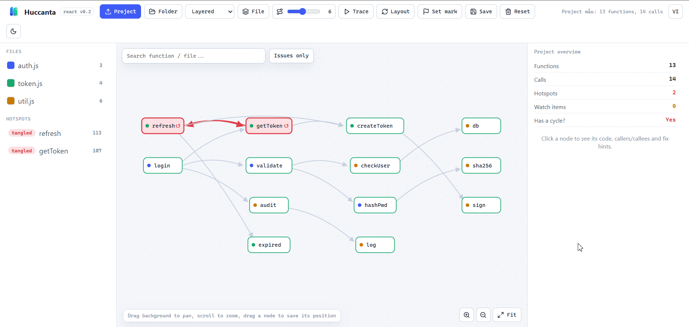

# Huccanta

A local-first codebase doctor for JavaScript/TypeScript. Beyond function/file maps and the Refactor Sandbox, the source now includes **Contract Radar** (connect HTTP clients to Express/Fastify/Nest/Next routes; check schemas, auth, statuses, and test coverage) and **Change Contract** (verify before/after snapshots against a policy, returning PASS/FAIL/UNKNOWN plus a fingerprint). Use them from the UI, MCP, HTTP APIs, or the CI CLI; everything runs locally.

**[Tiếng Việt](README.md)** · **English**



Huccanta scans your code, builds a graph of calls between functions, and surfaces the parts that are hard to maintain — call cycles, overly complex functions, tangled dependencies — with hints on how to untangle them. Everything runs locally; there is no external server and your code never leaves your machine.

## Why Huccanta (vs AI-codemap tools)?

"AI codemap" tools (an LLM reads your code and generates diagrams/summaries) are great at *pretty visuals and description*, but have three built-in weaknesses: **they hallucinate** (the LLM guesses relationships, not 100% accurate), **they send code to the cloud** (a non-starter for many teams), and **they only describe — they don't act**. Huccanta takes the opposite stance:

| | AI-codemap tools | **Huccanta** |
|---|---|---|
| Source of truth | LLM guesses (can hallucinate) | **Deterministic** static analysis (ts-morph / tree-sitter) |
| Privacy | Usually sends code to the cloud | **100% local**, code never leaves your machine |
| Verdicts | Generated prose | **Evidence + confidence**, never a blind guess |
| Action | View only | **Simulate a delete/change → blast radius** before you touch it |
| Role with AI | *Is* an LLM | **A tool AI agents call** (MCP) — it feeds ground truth to the AI |

In short: AI-codemap answers *"what does my code look like"*; Huccanta answers ***"what breaks if I change it"*** — **without hallucinating, without leaving your machine.**

**Differentiating (sellable) features:**

- **Refactor Sandbox** *(shipped)* — simulate deleting a file/function → see exactly what breaks + metric deltas, before you commit. No AI-codemap tool lets you "try a refactor".
- **Contract Radar** *(shipped)* — connect layers that never import each other: `fetch`/Axios instances ↔ Express/Fastify plugins/NestJS/Next routes; catch endpoint, request/response field, auth, and status drift plus routes without HTTP tests.
- **Change Contract** *(shipped)* — an agent declares allowed removals and regression budgets; Huccanta verifies before/after and emits a fail-closed structural certificate with a fingerprint.
- **Evidence-based safe-delete** *(shipped)* — clean up dead code safely (confidence ≤ 85%, never a reckless "dead" call).
- **Local-first** — sellable to security-conscious / regulated teams that cannot send code to a cloud LLM.
- **Guardrail for AI-written code** *(core shipped)* — agents call `contract_radar` + `verify_change` over MCP to self-check phantom routes/imports and new cycles.
- **CI gate** *(shipped)* — block PRs that regress contracts/structure with a real exit code.

## Comparison with adjacent projects

Huccanta is not trying to have the biggest graph. Its distinction is: **the graph explains context;
the contract decides whether a patch is acceptable**.

| Project | GitHub stars¹ | Primary focus | Stronger than Huccanta at | Huccanta's deliberate difference |
|---|---:|---|---|---|
| [CodeGraph](https://github.com/colbymchenry/codegraph) | ≈60.6k | Semantic context for coding agents | Persistent graph, auto-sync, broad language/agent support and impact/context retrieval | Change Contract `PASS/FAIL/UNKNOWN` + fingerprint and HTTP schema/auth/status drift |
| [Nx](https://github.com/nrwl/nx) | ≈29.1k | Monorepo build and CI orchestration | Cache, affected tasks, plugins and distributed CI | Evidence about a change, not a replacement for build orchestration |
| [Semgrep](https://github.com/semgrep/semgrep) | ≈15.9k | Pattern/SAST/SCA/secrets | Security rules and language coverage | Cross-layer HTTP contracts and declared patch intent |
| [CodeQL](https://github.com/github/codeql) | ≈9.8k | Semantic query and security analysis | Deep data-flow/query engine | Simpler contract evidence for reviewers; not a CodeQL replacement |
| [Sourcegraph](https://github.com/sourcegraph/sourcegraph-public-snapshot) | ≈10.3k | Large-scale code search/intelligence | Multi-repo indexing, references and migrations | Local snapshot-first guardrails for one change |

¹ Snapshot on 2026-07-18; stars indicate community scale, not quality or accuracy.

### Why Huccanta can tell the difference

Huccanta uses AST evidence, not an LLM-generated diagram: ts-morph resolves JS/TS symbols; the
tree-sitter path records grammar node types, owner/class, receiver and source location. A call is
connected only when the owner-qualified symbol or a unique same-file symbol proves the target.
Bare-name cross-file calls and ambiguous calls are omitted instead of guessed. `GraphEdge.resolution`
records whether the evidence was `exact` or `same-file`.

Contract Radar then checks the boundary that import graphs cannot see: HTTP method/path,
request/response fields, Authorization, statuses and test observations. Change Contract compares
before/after snapshots against an explicit policy, fails closed on `UNKNOWN`, and emits a SHA-256
fingerprint tied to the checked inputs.

## Overview

Reading an unfamiliar codebase is slow because control flow is scattered across files. Huccanta turns it into a map: each function is a node, each call a directed edge. From that map it automatically flags:

- **Cycles** — A calls B and B calls back to A (directly or indirectly), so the flow loops.
- **High complexity** — functions with many branches, hard to read and test.
- **High fan-in / fan-out** — too many places depend on one function, or one function reaches out to too many.

Click a node to see the real code, its callers/callees, why it was flagged and how to fix it. Turn on *Trace* to highlight the execution flow from any function, or set a *mark*, edit the code, and compare before/after.

Code can come from: pasted source, a local folder, or a Git repo URL to clone and scan. Scanned projects can be saved for quick reopening.

**Supported languages:** JavaScript/TypeScript (via ts-morph, with accurate symbol resolution) and **Python, Java, Go, C/C++, C#** (via tree-sitter). Tree-sitter languages use a conservative static resolver: qualified owner/receiver or a unique same-file symbol; bare-name cross-file calls and ambiguous calls are omitted instead of guessed.

## Requirements

- **Node.js ≥ 22** (the server uses `node:sqlite`, a built-in available only from Node 22).
- Git — only needed for the scan-from-URL feature.

## Install & run

```bash
npm install
npm run dev
```

`npm run dev` runs two local processes side by side: the UI (Vite) on port `5173` and the Analyzer API (Express) on port `3030`. Open `http://127.0.0.1:5173`.

The production build serves both from a single port:

```bash
npm run build     # type-check + bundle into dist/
npm run start     # server serves the UI + API at http://127.0.0.1:3030
npm test          # run unit tests (vitest)
```

Override the API port with `PORT`, and the SQLite file location with `HUCCANTA_DB`.

## Usage

1. Click **Project** to paste code / a Git URL, or **Folder** to pick a directory. A sample project loads on first run.
2. Read the map: red border = in a cycle, yellow = worth watching, green = fine.
3. Click a node to open its code, callers/callees, reasons and fixes.
4. Turn on **Trace** and pick a function to see its execution flow; adjust depth with the slider.
5. Set a **mark**, edit code, re-analyze to see how hotspots and complexity changed.
6. Click **Save** to store the project locally; reopen it from the *Saved projects* list.

## Internationalization (i18n)

The UI ships in **Vietnamese** and **English**, switched with the VI/EN button in the toolbar. The choice is remembered across sessions.

The i18n mechanism is small, hand-written and dependency-free — in [src/i18n.ts](src/i18n.ts):

- Each language is a flat `key → string` dictionary. `makeT(lang)` returns a translator `t(key, params?)`.
- Parameter interpolation uses `{name}` syntax:

  ```ts
  const t = makeT('en');
  t('status.result', { label: 'auth', nodes: 13, edges: 14 });
  // → "auth: 13 functions, 14 calls"
  ```

- A missing key in the current language **falls back to Vietnamese**, then to the `key` itself (it never crashes on a missing string).

A key design choice: **the server never returns translated strings.** Hotspots and API errors travel as **codes** (`issue.<code>`, `err.<code>`); the client translates them into the active language. So switching language needs no re-analysis.

**Add a string:** add the same `key` to **both** the `vi` and `en` dictionaries, then use `t('key')`.
**Add a language:** add its code to `type Lang` and the `LANGS` array, create a new dictionary (copy all keys from `vi`), and register it in `dict`.

## MCP server

Huccanta exposes its analyzer over the **Model Context Protocol** so AI agents (Cursor, Windsurf…) can call it directly in natural language, reusing the exact same multi-language analyzer as the app.

The MCP server ships as a **packet usable from any project** — just point it at the folder to analyze:

```bash
npx huccanta-mcp /path/to/your/project   # run as a standalone tool (stdio)
npm run mcp                              # or run it inside this repo
```

Tools ([server/mcp.ts](server/mcp.ts)):

| Tool | What it does |
|---|---|
| `analyze_code` | Scans a `path` (local folder) or inline `files`; returns an overview (functions, calls, hotspots, cycles) plus ranked hotspots. When launched with a folder (`npx huccanta-mcp <folder>`), the arguments can be omitted. |
| `get_function` | Detail of one function by `id` (`file#name`): code, callers, callees, issues. |
| `import_health` | **(Repo Doctor, JS/TS)** File-level import health report: possibly-unused files (with evidence + confidence), entry points, broken relative imports, stats. |
| `file_graph` | **(Repo Doctor Phase 2, JS/TS)** File-level dependency graph: node = file, edge = real import; flags file dependency cycles, classifies entry/normal/orphan, stats. |
| `simulate_change` | **(Refactor Sandbox)** Simulate deleting a file/function without touching the filesystem → blast radius (broken callers, newly-orphaned functions, affected tests) + metric deltas (cycles, hotspots, fan-out). |
| `contract_radar` | **(JS/TS)** Connects HTTP clients to Express/Fastify/Nest/Next routes; reports route/method/schema/auth/status drift, test coverage, no-local-consumer routes, and dynamic unknowns. |
| `verify_change` | **(Change Contract, JS/TS)** Compares `beforeFiles`/`afterFiles` against allow-lists and regression budgets; returns PASS/FAIL/UNKNOWN, evidence, and a SHA-256 fingerprint. |

Configure it in an MCP client:

```json
{
  "mcpServers": {
    "huccanta": { "command": "npx", "args": ["huccanta-mcp", "/path/to/your/project"] }
  }
}
```

## CI contract gate

Contract Radar ships a CLI with real exit codes for pull-request gates:

```bash
npx huccanta-contract .                         # strict: errors or unknowns fail
npx huccanta-contract --allow-unknown .         # block definite errors only
npx huccanta-contract --before base --after head --policy contract-policy.json
```

This repository runs `npm run contract:check` in GitHub Actions. The change gate reuses the
`verify_change` core; its fingerprint binds the exact snapshots and policy that were checked.

## Reproducible benchmark

Run `npm run benchmark` for a fixed six-language fixture (Python, Java, Go, C, C++, C#), ten measured
iterations after one warm-up, with median and p95 timings. It also asserts seven labeled edges and
four under-evidenced calls that must remain unresolved. This measures Huccanta's local parser and
Contract Radar; it is not apples-to-apples with CodeGraph's self-reported agent-level benchmark. Keep parser
speed, graph accuracy and agent token/tool reduction as separate metrics. The small ground-truth
fixture is a regression guard, not a claim of 100% accuracy on real repositories.

## Vision: Repo Doctor

> This is the **direction**, not shipped features. The sections above describe what runs today.

The long-term goal: don't just *draw* the code — help you *decide what to change or delete, safely*. Every verdict comes with **evidence and a confidence score**, never a single-signal guess.

**Three pillars we're building toward:**

1. **Evidence-based verdicts.** e.g. a file marked "possibly unused (82%)" with the evidence listed: not an entry point, no file imports it, no export is used, absent from routes/config, not reached by any test, last modified 19 months ago. Never "dead" from one signal — dead-code detection is notoriously wrong around DI, reflection, dynamic imports and route decorators.
2. **Simulate before you edit (Refactor Sandbox).** Pick delete file/function, rename, move, or extract a group → build a *shadow graph* and report the blast radius (broken imports, a route losing its handler, related tests, changes to cycles/fan-out/complexity) **without touching the filesystem**, then export a plan or patch.
3. **Static × Runtime.** Overlay what *actually ran* (from tests/commands) onto what *could* be called: **green** = both · **grey** = static-only · **purple** = runtime-only (framework calling dynamically) · **red** = broken import/call/route.

Plus a **missing-code detector**: unresolved imports; packages imported but not declared; a frontend API call with no matching route (and routes no one uses); env vars read but absent from `.env.example`; config pointing at nonexistent files; interfaces missing methods; routes without tests. For polyglot repos, link through **real contracts** instead of guessing: `fetch("/api/users")` → route/OpenAPI → `get_users()` → `users` table.

**Roadmap (MVP — JS/TS is the most precise zone; polyglot uses conservative static resolution):**

- ✅ **Phase 1 · Import Health Report** *(shipped — `import_health` tool + `POST /api/import-health`)* — entry / possibly-unused files (confidence + evidence); unresolved imports (assets ignored); stats. Based on ts-morph's real import/export resolution.
- ✅ **Phase 2 · File-level graph** *(shipped — `file_graph` tool + `POST /api/file-graph` + a **Function | File** toggle in the UI)* — node = file, edge = real import/export (ts-morph, no name-based guessing); flags **file dependency cycles** (circular imports) and classifies entry/normal/orphan. The **Contract** mode (route/OpenAPI/DB) is left for a later phase.
- ✅ **Phase 3 · Simulate delete (Refactor Sandbox)** *(shipped — `simulate_change` tool + `POST /api/simulate`)* — drop nodes from a shadow graph, list broken callers + newly-orphaned functions + affected tests, recompute cycles/fan-in-out. *(Built before Phase 2 as the flagship differentiator.)*
- ✅ **Phase 4 · Contract Radar** *(shipped — UI + `contract_radar` + `POST /api/contract-radar` + CI CLI)* — connect HTTP clients to route source, check schema/auth/status drift, and overlay HTTP test observations.
- ✅ **Phase 5 · Change Contract** *(shipped — `verify_change` + `POST /api/change-contract`)* — verify patch intent with structural deltas and a fail-closed policy.
- **Phase 6 · Test/runtime overlay** — declare a command (e.g. `npm test`), then overlay the runtime trace onto the static graph.

**Non-goals:** no race to 30 languages · no Neo4j platform · no generic AI chatbot · no mysterious "health score" without evidence · no "dead because fan-in is 0" · no prettier-3D-graph race.

## Project layout

```text
src/
  App.tsx        UI: toolbar, files/hotspots panel, SVG map, inspector
  analyzer.ts    Parse AST (ts-morph) → graph + hotspot scoring (SCC, complexity, fan-in/out)
  layout.ts      Layered / force layout
  types.ts       Data contract: Graph / Node / Edge / Issue
  i18n.ts        Vietnamese/English dictionaries + translator
server/
  analyze.ts     Multi-language entry: split JS/TS ↔ tree-sitter, merge + score
  contractRadar.ts  Connect HTTP client calls ↔ backend routes from JS/TS source
  changeContract.ts Verify before/after snapshots against policy + fingerprint
  contractCli.ts    Fail-closed CLI for CI/PR gates
  treesitter.ts  tree-sitter parser (Python/Java/Go/C/C++/C#) → graph
  index.ts       Local Express API; serves dist/ in production
  db.ts          Save projects to SQLite (node:sqlite)
  scan.ts        Scan folders/repos, filter source files
  mcp.ts         MCP server (stdio) exposing the analyzer to AI agents
bin/
  huccanta-mcp.mjs   `npx huccanta-mcp <folder>` — run the MCP server from any project
  huccanta-contract.mjs  Contract gate command for CI
tests/
  analyzer.test.ts, multilang.test.ts, contractRadar.test.ts, changeContract.test.ts
```

## Tech

React 18 · TypeScript · Vite 6 · Express · ts-morph · tree-sitter (WASM) · SQLite (`node:sqlite`) · MCP SDK · Vitest.

For architecture, algorithms and development conventions, see [docs/ARCHITECTURE.md](docs/ARCHITECTURE.md). For the contribution & release workflow, see [CONTRIBUTING.md](CONTRIBUTING.md).
