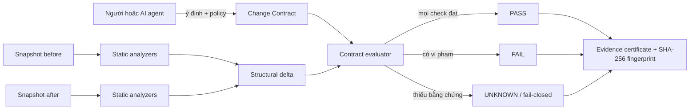
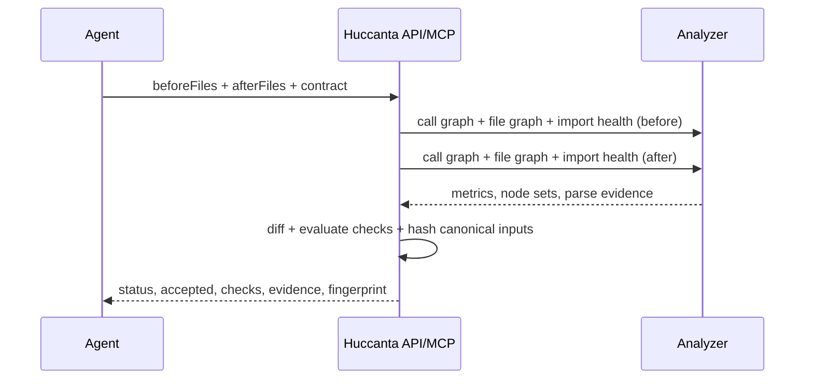

# Đặc tả · Change Contract — hộ chiếu thay đổi có bằng chứng

> Trạng thái: **✅ đã implement MVP**
> Phạm vi đầu tiên: **JavaScript/TypeScript, local-first, HTTP API + MCP**

## 0. Quyết định hướng đi

Huccanta không làm thêm một bản đồ code hoặc một điểm “sức khoẻ” tổng quát. Hướng mới là
**Change Contract**: trước khi nhận một patch do người hoặc AI agent tạo, bên tạo patch khai báo
ý định có thể kiểm tra được; Huccanta so sánh hai snapshot mã nguồn rồi phát hành một kết quả
`pass | fail | unknown` kèm bằng chứng và fingerprint ổn định.

Tên “hộ chiếu” mô tả một **chứng thư cấu trúc**, không phải chứng minh hình thức rằng chương trình
đúng. Fingerprint chỉ ràng buộc kết quả với đúng input và policy; nó không phải chữ ký số và không
chứng minh hành vi runtime.

## 1. Khoảng trống sản phẩm

Khảo sát tháng 07/2026 cho thấy các nhóm công cụ gần nhất giải các lát cắt khác:

| Nhóm | Làm tốt | Khoảng còn trống mà MVP nhắm tới |
|---|---|---|
| [CodeSee Maps/Review Maps](https://docs.codesee.io/docs/user-guide) | Vẽ file thay đổi và file có thể bị tác động trong PR | Không thấy contract theo ý định của từng patch và chứng thư tri-state portable |
| [Sourcegraph Code Navigation](https://sourcegraph.com/docs/code-navigation) | Definition/reference chính xác, kể cả cross-repo | Trả quan hệ để người/agent tự suy luận, không xác nhận ngân sách hồi quy của patch |
| [AppMap diagrams](https://appmap.io/docs/reference/guides/using-appmap-diagrams.html) | Trace runtime, dependency/sequence diagram và sequence diff | Cần chạy/instrument chương trình; không phải gate cấu trúc local từ hai snapshot source |
| [CodeScene](https://docs.enterprise.codescene.io/versions/3.4.7/codescene-enterprise-edition.pdf) | Hotspot, change coupling, virtual code review và quality gate | Gate theo metric/rule chung; không thấy “ý định patch → claim → evidence certificate” qua MCP |
| [ArchUnit](https://www.archunit.org/userguide/html/000_Index.html) | Architecture test do đội tự viết, dependency/layer/cycle rules | Luật dài hạn của codebase, không phải contract before/after riêng cho một thay đổi |

Vì vậy tuyên bố khác biệt của Huccanta là:

> **Mỗi thay đổi mang theo một contract về điều được phép xảy ra và một chứng thư bằng chứng
> deterministic để reviewer hoặc AI agent khác kiểm lại.**

Đây là kết luận về khoảng trống từ nhóm sản phẩm đã khảo sát, không phải khẳng định tuyệt đối rằng
không có bất kỳ prototype/research project nào cùng ý tưởng.

## 2. Ca sử dụng chính

Một coding agent tách module auth. Agent gửi cho Huccanta:

- snapshot `beforeFiles` và `afterFiles`;
- các file/hàm được phép xoá;
- file/hàm bắt buộc còn tồn tại;
- ngân sách tối đa cho import gãy, node mới rơi vào cycle và hotspot mới.

Huccanta trả:

- `pass`: mọi claim đã được kiểm và đạt;
- `fail`: có bằng chứng cụ thể vi phạm contract;
- `unknown`: analyzer không đủ bằng chứng, ví dụ snapshot có lỗi parse; **fail-closed**, tức
  `accepted=false`;
- fingerprint SHA-256 của snapshot + policy để chống tráo input sau khi review.

## 3. Luồng đặc tả





## 4. Hợp đồng input

```ts
interface ChangeContractPolicy {
  name?: string;
  allow?: {
    removedFiles?: string[];
    removedFunctions?: string[];
  };
  preserve?: {
    files?: string[];
    functions?: string[];
  };
  limits?: {
    maxNewUnresolvedImports?: number;   // mặc định 0
    maxNewFilesInCycles?: number;       // mặc định 0
    maxNewFunctionsInCycles?: number;   // mặc định 0
    maxNewHotspots?: number;            // mặc định 0
  };
}
```

Quy tắc chuẩn hoá:

1. Path đổi `\\` thành `/`, bỏ `./` và `/` đầu.
2. Danh sách được dedup + sort trước khi evaluate và hash.
3. Mọi limit mặc định `0` và phải là số nguyên không âm.
4. File/hàm bị xoá mà không nằm trong allow-list là vi phạm.
5. `preserve` là claim tường minh: target phải có trong snapshot sau.

## 5. Hợp đồng output

```ts
type ContractStatus = 'pass' | 'fail' | 'unknown';

interface ContractCheck {
  id:
    | 'analysis-complete'
    | 'removed-files-declared'
    | 'removed-functions-declared'
    | 'preserved-files-exist'
    | 'preserved-functions-exist'
    | 'unresolved-import-budget'
    | 'file-cycle-budget'
    | 'function-cycle-budget'
    | 'hotspot-budget';
  status: ContractStatus;
  summary: string;
  evidence: string[];
}

interface ChangeContractResult {
  schemaVersion: 1;
  status: ContractStatus;
  accepted: boolean; // chỉ true khi status = pass
  fingerprint: string; // "sha256:<hex>"
  inputDigests: { before: string; after: string; policy: string };
  policy: RequiredChangeContractPolicy;
  changes: {
    files: { added: string[]; removed: string[]; modified: string[] };
    functions: { added: string[]; removed: string[] };
    unresolvedImports: { added: string[]; resolved: string[] };
    filesEnteringCycles: string[];
    functionsEnteringCycles: string[];
    newHotspots: string[];
  };
  metrics: {
    before: ContractMetrics;
    after: ContractMetrics;
  };
  checks: ContractCheck[];
  limitations: string[];
}
```

`ContractMetrics` gồm: số file, hàm, unresolved import, file trong cycle, hàm trong cycle và hotspot.

## 6. Luật đánh giá

| Check | `pass` | `fail` | `unknown` |
|---|---|---|---|
| analysis-complete | Cả hai snapshot parse được | — | Có parse error hoặc không có file JS/TS |
| removed-*-declared | Mọi target mất đi nằm trong allow-list | Có target mất ngoài allow-list | Function check unknown nếu parse chưa hoàn chỉnh |
| preserved-*-exist | Mọi target preserve còn ở after | Có target chắc chắn không còn | Function check unknown nếu parse chưa hoàn chỉnh |
| *-budget | Số bằng chứng mới ≤ limit | Số bằng chứng mới > limit | Analyzer liên quan không hoàn chỉnh |

Trạng thái tổng:

1. Có ít nhất một `fail` → `fail`.
2. Không `fail` nhưng có `unknown` → `unknown`.
3. Còn lại → `pass`.

Không được biến `unknown` thành `pass`; đó là guardrail quan trọng khi agent dùng công cụ.

## 7. Kiến trúc MVP

- `server/changeContract.ts`: canonicalize input, chạy analyzer, dựng delta, evaluate và hash.
- `src/types.ts`: chỉ thêm types mới, không đổi contract cũ.
- `POST /api/change-contract`: endpoint local.
- MCP tool `verify_change`: bề mặt chính cho coding agent.
- CLI `huccanta-contract --before <dir> --after <dir> --policy <json>`: CI/PR gate dùng đúng lõi.
- `tests/changeContract.test.ts`: fixture pass/fail/unknown + fingerprint deterministic.
- README/ARCHITECTURE: cập nhật tính năng và giới hạn.

Change Contract là tính năng agent/CI-first; Contract Radar có report UI riêng, còn certificate
before/after được xuất qua API/MCP/CLI để pipeline lưu hoặc reviewer kiểm fingerprint.

## 8. Tiêu chí nghiệm thu

1. Refactor không đổi cấu trúc ngoài ngân sách → `pass`, fingerprint ổn định khi thứ tự file thay đổi.
2. Thêm import gãy → `fail`, evidence nêu đúng `file -> specifier`.
3. Xoá hàm ngoài allow-list → `fail`; thêm vào allow-list → check tương ứng `pass`.
4. Tạo call cycle/file cycle/hotspot mới vượt ngân sách → `fail` với ID cụ thể.
5. Snapshot JS/TS lỗi cú pháp → `unknown`, `accepted=false`.
6. HTTP và MCP dùng cùng một hàm lõi; không copy logic đánh giá.
7. `npm run build` và toàn bộ test hiện tại + test mới đều qua.

## 9. Ngoài phạm vi MVP

- Chứng minh tương đương hành vi hoặc formal verification.
- Chạy test/runtime trace, coverage, database/schema contract.
- Ký certificate bằng khoá của CI hoặc lưu provenance vào transparency log.
- Tự sửa patch khi contract fail.
- So khớp semantic khi hàm rename/move; MVP dùng ID ổn định `file#name` và cố ý fail bảo thủ.
