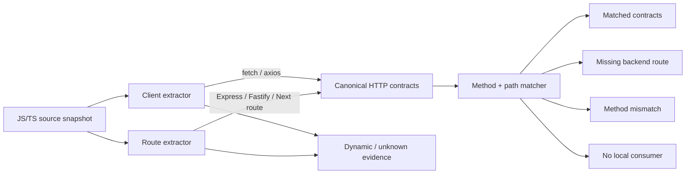
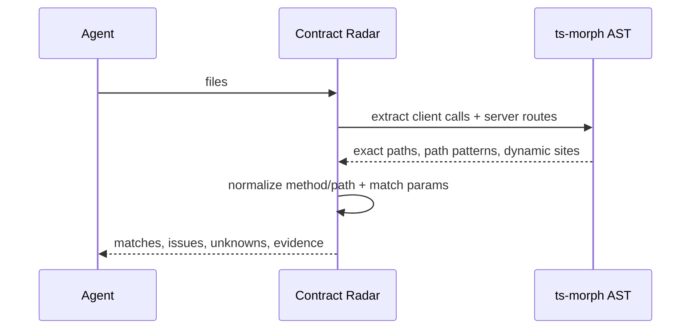

# Đặc tả · Contract Radar — tìm “khoảng trống” giữa các tầng code

> Trạng thái: **✅ đã implement MVP**
> Phạm vi hiện tại: **HTTP client ↔ backend route ↔ schema/auth/status ↔ HTTP test observation**

## 0. Vì sao đây là hướng nổi bật hơn một code map

Import graph chỉ thấy quan hệ được viết thành `import`; call graph chỉ thấy lời gọi mà analyzer resolve
được. Nhưng một frontend và backend thường “nói chuyện” qua chuỗi HTTP, nên hai phía **không hề có
cạnh code trực tiếp**:

```text
fetch('/api/users/42')   ─ ─ ─ hợp đồng vô hình ─ ─ ─▶   app.get('/api/users/:id')
```

Contract Radar dựng cạnh còn thiếu đó từ bằng chứng ở hai đầu. Nó trả lời ba câu hỏi thực dụng:

1. Client đang gọi endpoint nào mà server source hiện không có?
2. Client và server có cùng path nhưng lệch HTTP method không?
3. Route nào không có consumer **trong snapshot local** (không kết luận route “dead” vì có thể phục
   vụ mobile app, đối tác hoặc webhook)?

Khác biệt với nhóm công cụ gần nhất:

- [Optic](https://github.com/opticdev/optic) lint/diff/test dựa trên OpenAPI; Contract Radar đọc
  **hai đầu code thật**, không bắt buộc có spec.
- [Schemathesis](https://schemathesis.readthedocs.io/en/stable/quick-start/) sinh và chạy test từ
  OpenAPI/GraphQL; Contract Radar chạy static, local và không cần khởi động ứng dụng.
- [AppMap](https://appmap.io/docs/reference/guides/using-appmap-diagrams.html) thấy HTTP route trong
  trace runtime; Contract Radar thấy cả đường có thể gọi nhưng chưa được test/chạy.
- CodeSee/Sourcegraph chủ yếu vẽ dependency/reference trong code; HTTP string contract không phải
  một import/reference thông thường.

Tuyên bố sản phẩm:

> **Huccanta nối các tầng không import nhau và báo nơi contract bị khuyết, với exact evidence và
> mức độ không chắc chắn thay vì đoán.**

## 1. Luồng sản phẩm





## 2. Cú pháp MVP hỗ trợ

### 2.1 Client

| Cú pháp | Ví dụ | Kết quả |
|---|---|---|
| `fetch` mặc định | `fetch('/api/users')` | `GET /api/users` |
| `fetch` có method | `fetch('/api/users', { method: 'POST' })` | `POST /api/users` |
| Axios method/instance | `api.delete('/users/42')`, với `axios.create({baseURL:'/api'})` | `DELETE /api/users/42` |
| Template path | ``fetch(`/api/users/${id}`)`` | `GET /api/users/:dynamic` (`pattern`) |
| URL/method động không suy ra được | `fetch(url, options)` | đưa vào `unknowns`, không bịa endpoint |

### 2.2 Server

| Framework/style | Ví dụ |
|---|---|
| Express/Fastify direct | `app.get('/api/users/:id', handler)` |
| Express Router | `router.post('/users', handler)` |
| Chained route | `router.route('/users/:id').patch(handler)` |
| Router mount | `app.use('/api', router)`; ghép prefix nếu resolve được receiver |
| Fastify plugin | `app.register(users, { prefix: '/api' })` |
| NestJS | `@Controller('/api')` + `@Post('/users')` |
| Next App Router | `src/app/api/users/[id]/route.ts` export `GET` |

Receiver route phải có bằng chứng khởi tạo (`express()`, `Router()`, `express.Router()`, `fastify()`)
hoặc type/name parameter rõ ràng; không coi mọi `object.get()` là route.

## 3. Chuẩn hoá và so khớp

1. Method viết hoa; `all` ở server thành `ANY`.
2. Bỏ origin/query/hash, bảo đảm path có `/` đầu và bỏ `/` cuối (trừ root).
3. `:id`, `[id]` và `${expr}` được chuẩn hoá thành một segment động.
4. `*`, `[...slug]` là wildcard nhiều segment.
5. Match khi method bằng nhau (hoặc route `ANY`) và từng segment path tương thích.
6. Cùng path nhưng không có method tương thích → `method-mismatch`; không có path tương thích →
   `missing-route`.

## 4. Hợp đồng dữ liệu

```ts
type HttpMethod = 'GET' | 'POST' | 'PUT' | 'PATCH' | 'DELETE' | 'OPTIONS' | 'HEAD' | 'ANY';
type ContractConfidence = 'exact' | 'pattern';

interface HttpContractEndpoint {
  id: string;
  side: 'client' | 'server';
  method: HttpMethod;
  path: string;
  file: string;
  line: number;
  framework: 'fetch' | 'axios' | 'express' | 'fastify' | 'nest' | 'next';
  confidence: ContractConfidence;
  contract: {
    requestFields: string[];
    responseFields: string[];
    auth: 'present' | 'required' | 'absent' | 'unknown';
    statuses: number[];
  };
  coveredBy: string[];
}

interface HttpContractIssue {
  kind: 'missing-route' | 'method-mismatch' | 'request-schema-mismatch'
    | 'response-schema-mismatch' | 'missing-auth' | 'status-mismatch'
    | 'route-without-test' | 'no-local-consumer';
  severity: 'error' | 'warning' | 'info';
  endpointId: string;
  message: string;
  candidates: string[];
}

interface ContractUnknown {
  side: 'client' | 'server';
  file: string;
  line: number;
  expression: string;
  reason: string;
}

interface ContractRadarReport {
  summary: {
    clientCalls: number;
    serverRoutes: number;
    matches: number;
    missingRoutes: number;
    methodMismatches: number;
    requestSchemaMismatches: number;
    responseSchemaMismatches: number;
    missingAuth: number;
    statusMismatches: number;
    routesWithTests: number;
    routesWithoutTests: number;
    noLocalConsumers: number;
    unknowns: number;
  };
  clients: HttpContractEndpoint[];
  routes: HttpContractEndpoint[];
  observations: HttpContractObservation[];
  matches: { clientId: string; routeId: string }[];
  issues: HttpContractIssue[];
  unknowns: ContractUnknown[];
  limitations: string[];
}
```

Mọi mảng output sort ổn định. `id` được dựng từ side + method + path + file + line, nên evidence có
thể được agent trích dẫn lại mà không cần văn bản mơ hồ.

## 5. Chính sách bằng chứng

- `missing-route` là `error` chỉ khi URL + method client là literal/pattern tĩnh và analyzer đã thấy
  tập route local.
- `method-mismatch` là `error`, kèm ID route cùng path để sửa đúng phía.
- `no-local-consumer` chỉ là `info`; tuyệt đối không gọi route là “dead”.
- Request/response fields được suy luận từ object literal và property access; auth từ Authorization
  header/guard middleware; status từ response comparison và `res.status`/`reply.code`/`@HttpCode`.
- Supertest hoặc HTTP call trong `*.test.*`/`*.spec.*` được phủ lên route dưới dạng test observation;
  route chưa có observation chỉ là warning.
- Mọi biểu thức động đi vào `unknowns`; không làm tăng số missing.
- Nếu file parse lỗi, thêm `unknown` theo file và vẫn trả bằng chứng chắc chắn từ các file còn lại.

## 6. Kiến trúc MVP

- `server/contractRadar.ts`: ts-morph in-memory extractor + matcher dùng chung.
- `src/types.ts`: types output additive.
- `POST /api/contract-radar`: nhận `{ files }`.
- MCP tool `contract_radar`: bề mặt agent-first.
- UI: nút **Contract** mở report sheet.
- CLI `huccanta-contract`: gate strict/fail-closed cho CI; có `--allow-unknown` waiver tường minh.
- `tests/contractRadar.test.ts`: fetch/Express match, missing, method mismatch, route param/template,
  router mount, Next route và dynamic unknown.

## 7. Tiêu chí nghiệm thu

1. `fetch('/api/users/42')` match `app.get('/api/users/:id')`.
2. `POST /api/users` không match route `GET /api/users` và ra `method-mismatch`.
3. Client literal không có route ra `missing-route` với file + line chính xác.
4. Router mount ghép đúng prefix khi receiver resolve được.
5. Next App Router `[id]/route.ts` được chuyển thành `:id`.
6. `fetch(url)` ra `unknown`, không ra missing-route giả.
7. Output deterministic; build và toàn bộ test qua.

## 8. Ngoài phạm vi hiện tại

- OpenAPI/Pact import, runtime replay hoặc tự sinh test.
- Resolve mọi wrapper HTTP tự viết và mọi metaprogramming của framework; hiện hỗ trợ Axios instance.
- Kết luận route không có local consumer là code chết.
- Runtime observation từ trace thật; hiện đã có static HTTP test observation.
